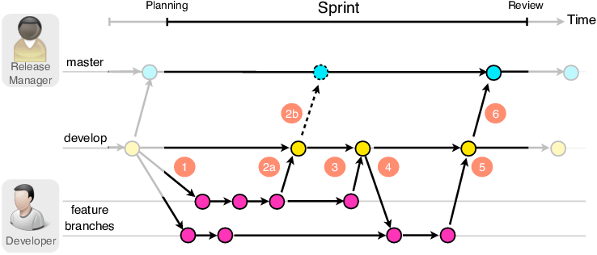
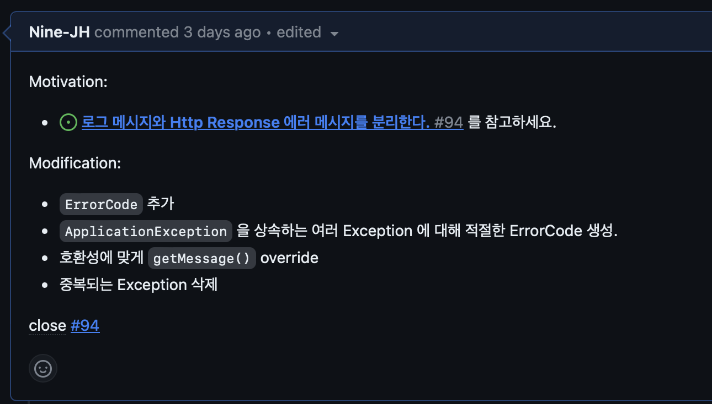

# Git 컨벤션

## Branch 전략



- branch 전략은 `***gitflow***` 을 채택했습니다.
- git branch 들은 아래의 종류가 있습니다.

```
--------------------------------------------------------------------------
feat : 새로운 기능 추가
fix : 버그 수정
docs : 문서 수정
refactor : 코드 리팩토링, 세미콜론 누락, 코드 변경이 없는 경우
test : 테스트 코드 포맷팅, 리팩토링 테스트 코드 추가
---------------------------------------------------------------------------
```

### 예시

```
feat/개발기능
refactor/00리팩토링
```

## 커밋 컨벤션

- 커밋 메시지는 한글로 작성한다.
- 커밋 메시지의 타이틀에는 Header과 개괄적인 변경사항을 작성한다.
- 커밋에는 코드를 짜게 된 `***동기(Motivation)***`과, `***개괄적인 변경사항(Modification)***`이 들어가야 한다.

### 예시

```
[refactor] 서버 log 메시지, httpResponse 메시지 분리

Motivation:

 - #94 를 참고하세요.

Modification:

- ErrorCode 추가
- ApplicationException 을 상속하는 여러 Exception 에 대해 적절한 ErrorCode 생성.
- 호환성에 맞게 getMessage() override
- 중복되는 Exception 삭제

close #94
```



## Github 컨벤션

### Github Issue

```
###을 개발한다.

개발 동기
- ooo을 이유로 개발(수정)을 합니다.

개발 사항
- [ ] 000 추가
- [ ] 000 수정
```

- 개발을 시작하기 전 Github Issue에 자신이 어떤 것을 개발할 것인지에 대해 작성을 한다.

### Pull Request

- 작성한 Issue에 기반하여 작업 후 `develop` 브랜치에 풀 리퀘스트를 작성합니다.
- 풀 리퀘스트의 내용은 자세한 내용이 필요한 경우를 제외하면 다음과 같이 작성했던 Issue와 연결시키면 됩니다.

```
close #123(이슈 번호)
```

- **2명 이상 Approve**를 해야 머지 가능합니다.