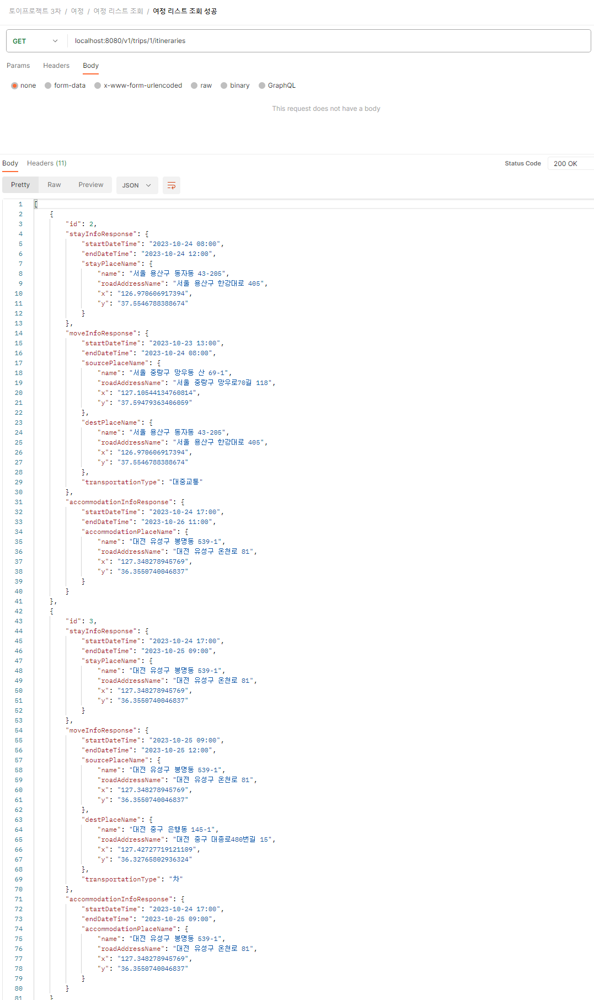
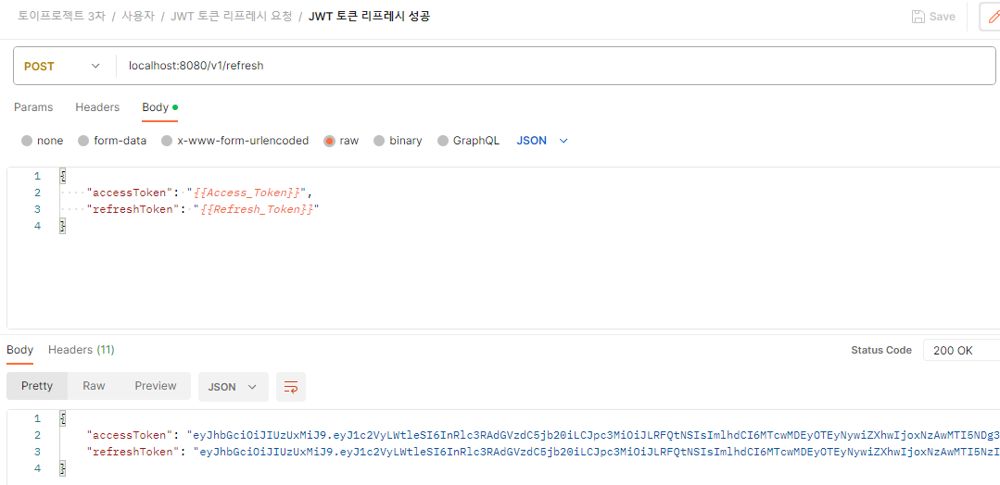

# 실행 결과 화면과 포스트맨 캡쳐 화면

## 실행 결과 화면

## 포스트맨 캡쳐 화면

자세한 사항은 아래 링크에서도 확인해보실 수 있습니다.

## 여행

### 여행 리스트 조회

### 여행 조회

### 여행 등록

### 여행 수정

### 여행 검색

## 여정

### 여정 리스트 조회

### 여정 조회

### 여정 등록

### 여정 수정

## 좋아요

### 여행 정보에 좋아요 누르기

### 좋아요를 눌렀던 여행 정보 조회

## 댓글

### 여행 정보에 댓글 달기

## 사용자

### 회원가입

### 로그인

### JWT 토큰 리프레시 요청

