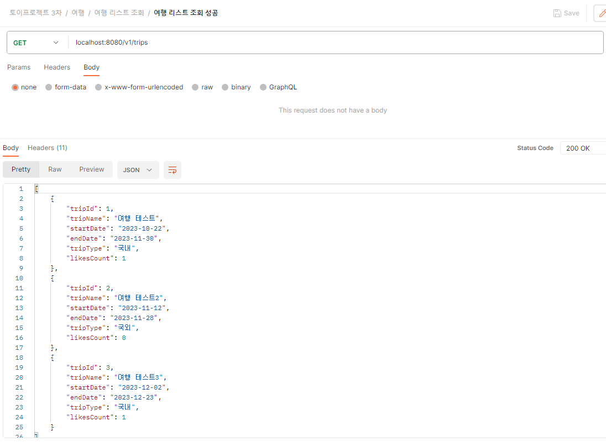
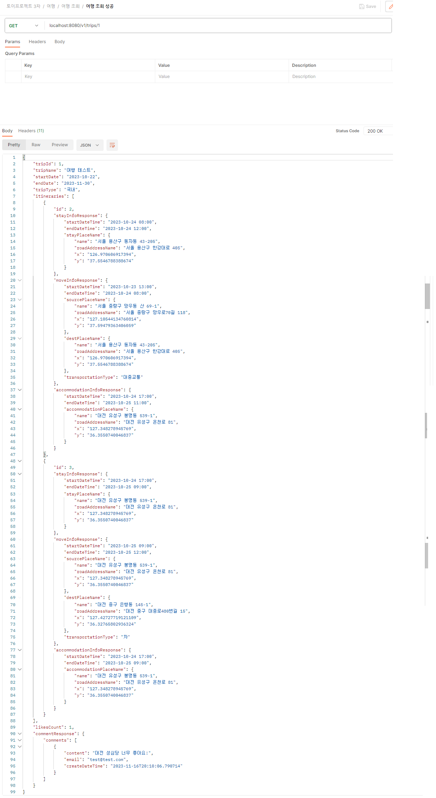
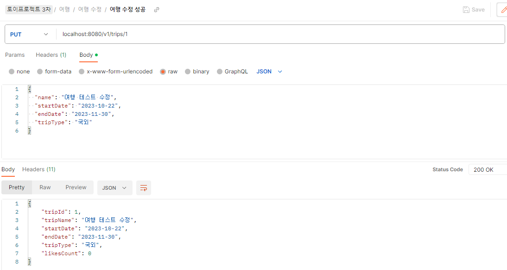
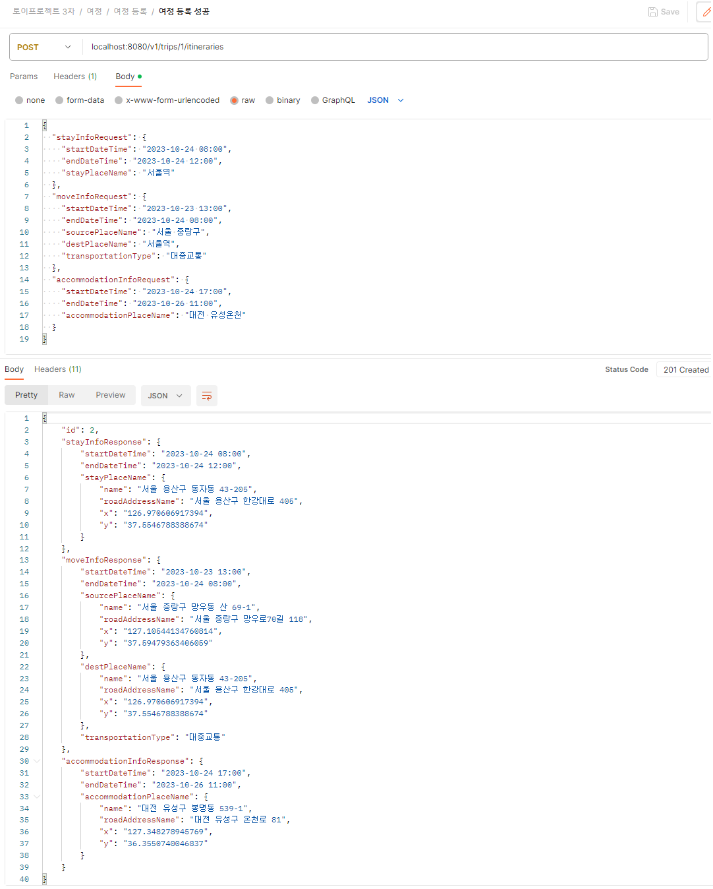

# 실행 결과 화면과 포스트맨 캡쳐 화면

## 실행 결과 화면

## 포스트맨 캡쳐 화면

자세한 사항은 아래 링크에서 확인해보실 수 있습니다.

### 여행

### 여행 리스트 조회

### 여행 조회

### 여행 등록

### 여행 수정

### 여정

### 여정 리스트 조회

### 여정 조회

### 여정 등록

### 여정 수정

