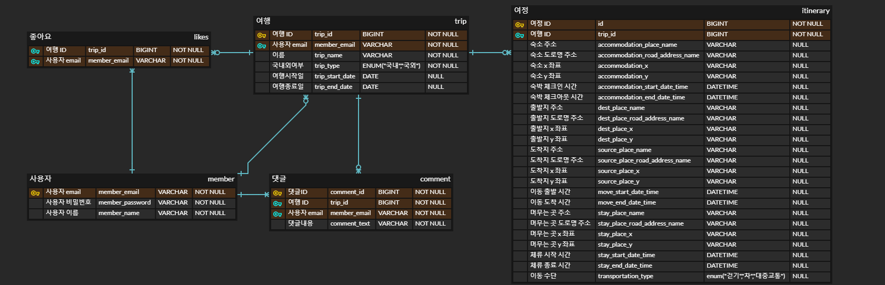
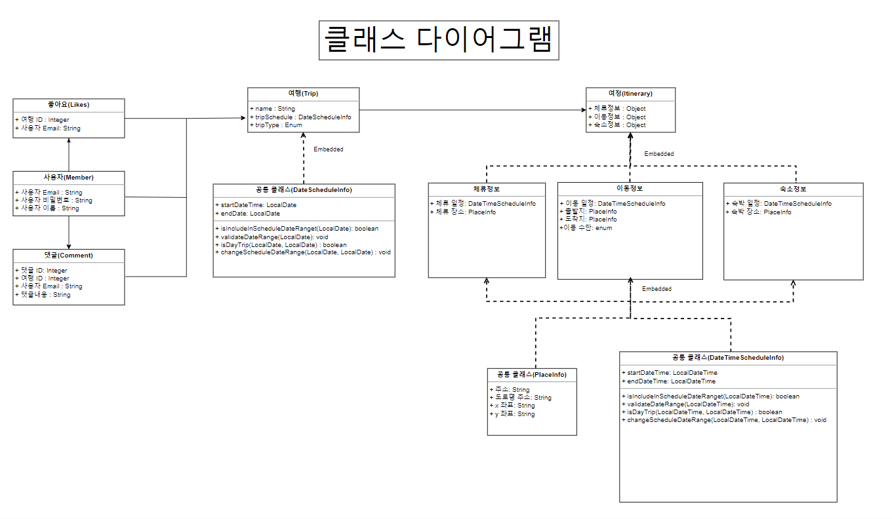

# [4조] 토이 프로젝트2 : 여행 여정을 기록과 관리하는 SNS 서비스 2단계

## 🎢 실행 결과 화면과 포스트맨 캡쳐 화면

[실행 결과 화면과 포스트맨 캡쳐 화면 문서 링크](/docs/RUNNING_SCREEN.md)

## ✨실행환경 설정 방법

- `.env` 파일을 만들어야 합니다. env 파일은 다음과 같은 내용을 포함해야 합니다.
  ```
  LOCAL_MYSQL_USERNAME=<MYSQL의 ROOT username>
  LOCAL_MYSQL_PASSWORD=<MYSQL의 ROOT password>
  LOCAL_MYSQL_VOLUME_PATH=./bin/mysql # MYSQL 데이터를 저장할 본인 컴퓨터 경로
  LOCAL_MYSQL_PORT=3306 # 컴퓨터에서 사용할 PORT
  ```
- docker compose를 사용하여 mysql 데이터베이스 환경을 만들 수 있습니다.
    - 인텔리제이의 docker plugin 기능을 사용하시거나, 다음 명령어를 입력해서 데이터베이스 환경을 구성하세요.
  ```
  docker compose up
  ```

## 🧑‍🤝‍🧑 조원 & 역할

| 이름  | 역할                    |
|-----|-----------------------|
| 한상우 | 조장, 여행 도메인 개발, 문서 관리  |
| 구자현 | 설계, git 관리, QA, 공통 처리 |
| 박경탁 | 여행 도메인 개발             |
| 심재철 | 여정 도메인 개발             |
| 이민균 | 여정 도메인 개발             |

## 🚀 프로젝트 일정

- 프로젝트 기간: 10월 23일(월) ~ 10월 27일(금)


## 🧾 프로젝트 설명

- 여행 및 여정 정보를 조회, 등록, 수정할 수 있는 Spring Boot 기반 RESTful API 서버입니다.
- 여행 및 여정 정보는 관계형 데이터베이스(Mysql)에 저장됩니다.
- **3-Layered(Controller-Service-Repository) 패턴**으로 설계했습니다.
- Swagger를 통해 API를 문서화했습니다.
- 사전에 코드 컨벤션과 git 컨벤션을 정한 뒤 개발을 진행했습니다.
- Github의 Issue와 Pull Request 기능을 활용하여 개발했습니다.
- 여행과 여정 컨트롤러의 통합 테스트 코드를 작성했습니다.

## 🛠️ 개발 환경

- 자바 버전 : **17**
- 스프링 버전 : **Spring Boot 3**
- 데이터베이스 : Mysql (+ docker-compose)
- 문서화 도구 : Swagger
- 의존성(자세한 내용은 [build.gradle](./build.gradle)을 참고해주세요!)
    - data-JPA
    - validation
    - lombok

## ⚙ API 문서

### Swagger

API 문서는 서버를 구동한 뒤, 다음 링크의 Swagger UI에서 확인해 보실 수 있습니다.

```
http://localhost:8080/swagger-ui/index.html
```

### Postman

다음 포스트맨에서도 API 문서를 확인해 보실 수 있습니다.

[](https://documenter.getpostman.com/view/828796/2s9YRGx9N9)

## 📐 ERD 설계도

### 전체 ERD 설계도



### DB 관련 클래스 다이어그램



## 📦 패키지 구조

```
├── README.md
├── build.gradle
├── settings.gradle
└── src
    ├── main
    │   ├── java
    │   │   └── com
    │   │       └── kdt_y_be_toy_project2
    │   │           ├── domain
    │   │           │   ├── itinerary
    │   │           │   │   ├── controller
    │   │           │   │   ├── domain
    │   │           │   │   ├── dto
    │   │           │   │   ├── exception
    │   │           │   │   ├── repository
    │   │           │   │   └── service
    │   │           │   ├── model
    │   │           │   │   └── exception
    │   │           │   └── trip
    │   │           │       ├── controller
    │   │           │       ├── domain
    │   │           │       ├── dto
    │   │           │       ├── exception
    │   │           │       ├── repository
    │   │           │       └── service
    │   │           └── global
    │   │               ├── config
    │   │               ├── error
    │   │               └── util
    │   └── resources
    │       └── application*.properties
    └── test
        └── java
            └── com
                └── kdt_y_be_toy_project2
                    ├── integeration
                    ├── domain
                    │   ├── trip
                    │   │   └── controller
                    │   ├── itinerary
                    │   │   └── controller
                    │   └── model
                    └── global
                        └── factory
```

## ⌨️ 코드 컨벤션

[코드 컨벤션 링크](/docs/CODE_CONVENTION.md)

## 🤝 Git 컨벤션

[Git 컨벤션 링크](/docs/GIT_CONVENTION.md)
